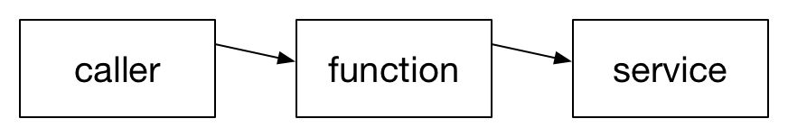

```{r setup, include=FALSE}
knitr::opts_chunk$set(echo = TRUE)
```

Email: jim@tyhurst.com <br>
Twitter: @jimtyhurst <br>
GitHub: https://github.com/jimtyhurst/i18nr

[CascadiaRConf 2017](https://cascadiarconf.com/) 5-minute Lightning Talk

## Abstract

As an R developer, I sometimes need to parameterize functions, so that they can be re-used across different populations. One example is where model parameters vary across countries. This talk presents a coding idiom for internationalizing a function, where the output depends on the locale in which the sampling occurred. This idiom enables code reuse and enhances testability. I demonstrate the idiom with sample code from scoring an international student assessment.

## Scenario



* Scenario: function performs some activity that varies by country.
* _Design Question_: Which function has responsibility for holding localized data?
* 3 possibilities:
    - caller
    - function
    - service

### Sample problem
Translate ISCED level to number of years of education.

http://uis.unesco.org/sites/default/files/documents/international-standard-classification-of-education-isced-2011-en.pdf (86-page document that specifies 9 levels of education)

International Standard Classification of Education

| ISCED level | Criteria |
|-------------|----------|
| 0 | Early childhood education |
| 1 | Primary education |
| 2 | Lower secondary education |
| 3 | Upper secondary education |
| 4 | Post-secondary non-tertiary education |
| 5 | Short-cycle tertiary education |
| 6 | Bachelor’s or equivalent |
| 7 | Master’s or equivalent level |
| 8 | Doctoral or equivalent level |

## Simple implementation: not internationalized

```{r}
# ISCED Code to Years of Education for the United States.
# http://www.oecd.org/pisa/sitedocument/PISA-2015-Technical-Report-2015-Annex-D-Mapping-of-ISCED.xlsx
iscedToYearMapping <- list("0" = 3, "1" = 6, "2" = 9, "3A" = 12, "3B" = NA, "3C" = NA, "5A" = 16, "5B" = 14, "6" = 16)

iscedToYearMapper <- function(iscedCode) {
  return(iscedToYearMapping[[iscedCode]])
}
iscedToYearMapper("3A")

iscedToYears <- function(responses) {
  encodedResponses <- data.frame(
    studentId = responses$studentId,
    yearsOfEducationMother = sapply(responses$iscedMother, iscedToYearMapper, simplify = TRUE, USE.NAMES = FALSE),
    yearsOfEducationFather = sapply(responses$iscedFather, iscedToYearMapper, simplify = TRUE, USE.NAMES = FALSE),
    stringsAsFactors = FALSE
  )
  return(encodedResponses)
}
```

### Sample usage

```{r}
responses <- data.frame(
  studentId = c("6d1afd4b566c", "41f889d9c304", "5fcddf45f746", "cdcae54c1dd9", "a880eee54b90"),
  iscedMother = c("0", "1", "2", "3A", "3B"),
  iscedFather = c("3C", "5A", "5B", "5A", "6"),
  stringsAsFactors = FALSE
)
encodedResponses <- iscedToYears(responses)
encodedResponses
```

## i18n option 1: Localized values in the function

* Almost same solution as previously, but mapping has another dimension for 'country'.

```{r}
# ISCED Code to Years of Education for Spain ("es") and the United States ("us").
# http://www.oecd.org/pisa/sitedocument/PISA-2015-Technical-Report-2015-Annex-D-Mapping-of-ISCED.xlsx
# Mapping is 2-dimensional now, because each country has its own encoding
iscedToYearMapping <- data.frame(
  country = c("es", "us"),
  "0" = c(3, 3),
  "1" = c(5, 6),
  "2" = c(8, 9),
  "3A" = c(12, 12),
  "3B" = c(10, NA),
  "3C" = c(10, NA),
  "5A" = c(16.5, 16),
  "5B" = c(13, 14),
  "6" = c(16.5, 16),
  stringsAsFactors = FALSE,
  check.names = FALSE
)
iscedToYearMapping

# a function that returns a function!
iscedToYearMapper <- function(countryCode) {
  return(function(iscedCode) {
    iscedToYearMapping[iscedToYearMapping$country == countryCode, ][[iscedCode]]
  })
}

# Adds a 'countryCode' parameter.
iscedToYears <- function(responses, countryCode) {
  encodedResponses <- data.frame(
    studentId = responses$studentId,
    yearsOfEducationMother = sapply(responses$iscedMother, iscedToYearMapper(countryCode), simplify = TRUE, USE.NAMES = FALSE),
    yearsOfEducationFather = sapply(responses$iscedFather, iscedToYearMapper(countryCode), simplify = TRUE, USE.NAMES = FALSE),
    stringsAsFactors = FALSE
  )
  return(encodedResponses)
}
```

### Sample usage of option 1: Localized values in the function

```{r}
# Adds a countryCode parameter to previous solution.
iscedToYears(responses, countryCode = "es")
iscedToYears(responses, countryCode = "us")
```

## i18n option 2: Localized values in the service
For example, caller provides URL for a web service as a parameter to the function.

_Pseudo Code:_ <br>
encodedResponses <- iscedToYears(responses, countryCode, iscedMapperUri)

## i18n option 3: Localized values in the caller
Caller owns the model and passes localized data to the function.

```{r}
iscedToYears <- function(responses, localizedIscedToYearMapping) {
  localizedIscedToYearMapper <- function(iscedCode) {
    return(localizedIscedToYearMapping[[iscedCode]])
  }
  encodedResponses <- data.frame(
    studentId = responses$studentId,
    yearsOfEducationMother = sapply(responses$iscedMother, localizedIscedToYearMapper, simplify = TRUE, USE.NAMES = FALSE),
    yearsOfEducationFather = sapply(responses$iscedFather, localizedIscedToYearMapper, simplify = TRUE, USE.NAMES = FALSE),
    stringsAsFactors = FALSE
  )
  return(encodedResponses)
}

countryCode <- "es"
encodedResponses <- iscedToYears(responses, 
                                 localizedIscedToYearMapping = iscedToYearMapping[iscedToYearMapping$country == countryCode, ])
encodedResponses
```

## Which solution is best?
It depends ...

| Localized values | Context                | Advantages                  |
|------------------|------------------------|-----------------------------|
| function         | Simple model does not change over time. Function not re-used for multiple purposes. | Simplest solution. No dynamic configuration. Values and usage in one place. |
| service          | Use of third party required; or size of model requires separate process; or model constructed dynamically/often. | Prefer injection of service (or gateway to service) into function to facilitate unit testing of function. |
| caller           | Set of pre-defined models. Function needs to be re-usable/configurable. | Caller has coordinator role specifying configuration of functions using pre-defined models. Functions are easy to unit test. Functions are re-usable in multiple workflows. |

## Background information

My motivation for thinking about these problems came from working on an international school scoring application at Northwest Evaluation Association ([NWEA](https://www.nwea.org/assessments/oecd-test-for-schools/)). The information presented here is based on publicly available data and algorithms from a different, but related, international test, which I have never worked on, the [OECD PISA test](http://www.oecd.org/pisa/).

### Disclaimer
The response data and format used in this presentation were constructed for pedagogical purposes. Neither the data nor format are derived from actual test responses.

### OECD
[Organization for Economic and Cooperative Development](http://www.oecd.org/) (OECD)

"The mission of the Organisation for Economic Co-operation and Development (OECD) is to promote policies that will improve the economic and social well-being of people around the world."

### OECD's PISA Test
[Programme for International Student Assessment](http://www.oecd.org/pisa/) (PISA)

"The Programme for International Student Assessment (PISA) is a triennial international survey which aims to evaluate education systems worldwide by testing the skills and knowledge of 15-year-old students."

A Technical Report specifies the test design and the scoring algorithms:
http://www.oecd.org/pisa/data/2015-technical-report/

Table of ISCED code to years of education by country:
http://www.oecd.org/pisa/sitedocument/PISA-2015-Technical-Report-2015-Annex-D-Mapping-of-ISCED.xlsx

### ISCED
http://uis.unesco.org/en/topic/international-standard-classification-education-isced

"The International Standard Classification of Education (ISCED 2011) provides a comprehensive framework for organising education programmes and qualification by applying uniform and internationally agreed definitions to facilitate comparisons of education systems across countries."

"Since education systems vary in structure and content across countries, the International Standard Classifcation of Education (ISCED) provides the framework for presenting data in a comparable and uniform manner. It facilitates the transformation of national education data into internationally agreed categories that make cross-national comparisons possible."
